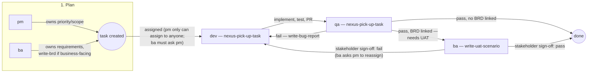

# Workflow — the whole pipeline, one place

Each role's own `.agents/agents/*.md` documents its own step in detail — this file is the missing piece: the *sequence* across all of them, so it's clear who hands to whom and why, instead of that being scattered across four files with no single picture. Read this first for the shape of the process; read the role's own file for the exact mechanics of its step.

Status **names** are never fixed here on purpose — every role's skill says "check `list_statuses` first," because they vary per project. What's fixed is the *sequence of roles* and the *rule that makes hand-off actually work* (below), not any particular status string.

## The main sequence

1. **pm / ba plan** — `nexus-plan-work`. Either can create the task (ADMIN/PM/BA are the only roles that can — `task:create`/`backlog:manage` are `false` for dev/qa, this is a real server-side 403, not convention). Only **pm** can assign it to anyone freely (`task:assign: true`); **ba cannot assign at all** (`task:assign: false`) — ba creates it unassigned and asks pm to assign, or leaves it for pm to pick up during planning. If the work traces back to a real business need (not a one-line bug fix), ba writes a `write-brd` first and links it to the epic via comment — that link is what step 3 checks for. ba writes the task's actual description/AC via `write-user-story` (not `nexus-plan-work` itself — that skill only covers which fields/tool calls to set, not what the content should say); pm uses `write-sprint-plan` when the ask is "what goes into the next sprint" rather than a single task.
2. **dev implements** — `nexus-pick-up-task`. Reads full context, checks `blockedBy`, matches repo conventions, implements, verifies (tests/lint/build — optionally with a `dev`-persona code-review pre-check and/or a `qa`-persona pre-check first, see dev's own file), opens a PR (a real human still has to approve it — the pre-checks below narrow what they find, they don't replace them), hands off: status change + reassign to qa, together (see "why hand-off is one action" below). If the team has a **lead** (see `roles/lead`), they do this exact same step — lead *is* dev, plus one elevated right: reassigning any task in the project, not just one they hold, so they can rebalance work across the dev team without going through pm every time.
3. **qa tests** — `nexus-pick-up-task`. For a whole feature/release (not a single task), qa writes a `write-test-plan` first to set scope/risk areas; either way, qa writes `write-test-case`s before testing rather than improvising. Checks against acceptance criteria.
   - **Fail** → `write-bug-report`, status back to whatever means "needs rework," reassign back to whoever implemented it. Never just a comment with no reassignment — an unowned task doesn't show up in anyone's list, it just goes quiet.
   - **Pass, no BRD linked** (technical work — bug fix, refactor, infra) → close it out directly, same as before.
   - **Pass, BRD linked** (real business-facing work) → don't close it yet — reassign to ba for UAT, status to whatever means "awaiting UAT."
4. **ba runs UAT** (only for tasks step 3 routed here) — `write-uat-scenario`, using the linked BRD. Writes the scenario, hands it to the actual stakeholder, and **stops** — pass/fail is a real business sign-off, not something ba (or any agent) decides on the stakeholder's behalf. Once a real verdict comes back:
   - **Pass** → ba closes it directly (status-only change, no reassignment needed — ba is already the assignee).
   - **Fail** → ba writes up the gap between what was asked for and what shipped, but **cannot reassign it back to dev itself** (`task:assign: false`, same boundary as everywhere else in ba's file) — asks pm to do the reassignment.

That's the whole main line. Everything below is a *side channel* on top of it — none of it replaces this sequence.

## Side channels — questions and pre-checks that don't derail the main sequence

- **A role hits a decision that's genuinely someone else's call mid-step** (not who does the task next — just "what should the answer be") → `nexus-consult-teammate` (same-session, `Agent` tool, fastest, works unattended too) or `nexus-consult-role` (cross-process, real person's real authority, durable `[CONSULT]`/`[ESCALATED]`-tagged record). Neither of these changes who owns the task — the asker keeps working, informed.
- **dev wants a second look at the diff before opening the PR** → same mechanism, `subagent_type: "dev"`, tagged `[PRE-CHECK]` — an agent-side code-review pass (logic, edge cases, convention) that narrows what the real human PR reviewer finds. Never a substitute for that human approval — there is no agent-side mechanism that grants PR approval, and none is planned; that gate stays human on purpose.
- **dev wants a second look at test coverage before opening the PR** → same mechanism, `subagent_type: "qa"`, tagged `[PRE-CHECK]` — never a substitute for step 3's real QA pass.

## Why hand-off is one action, not two

Every arrow in the diagram above is a **status change and a reassignment happening in the same `update_task` call**, not two separate steps. This isn't style — a status-only or assignee-only update fires no event at all (confirmed by reading the actual route), and it's the event that wakes up the next person/agent's Agent App automatically. Split the two calls and the hand-off still "works" (the data's correct) but nobody gets notified until they happen to check.

## Who can create/assign what — the real, server-enforced matrix

| Action | ADMIN | PM | BA | DEV | LEAD | QA |
|---|---|---|---|---|---|---|
| Create task | ✓ | ✓ | ✓ | ✗ | ✗ | ✗ |
| Create/edit epic, story (`backlog:manage`) | ✓ | ✓ | ✓ | ✗ | ✗ | ✗ |
| Assign task to anyone (`task:assign`) | ✓ | ✓ | ✗ | owner-only | ✓ | owner-only |
| Edit task fields (`task:edit`) | ✓ | ✓ | ✓ | owner-only | owner-only | owner-only |
| Comment (`task:comment`) | ✓ | ✓ | ✓ | ✓ | ✓ | ✓ |

"owner-only" means: only on a task that role is *currently* the assignee of — a dev can hand off a task they hold, not reassign someone else's. This table is enforced server-side (`src/lib/permissions.ts` in pm-system) — a role's own `.agents/agents/*.md` documents the parts of it that role hits in practice; this table is the one place all of it is visible together.

**LEAD is wired differently from the other six** — it isn't a row in `permissions.ts`'s `DEFAULT_MATRIX` at all. It's a DB-only role (`prisma/seed-add-lead-role.ts`) that sets `parentRoleId` to DEV and adds exactly two `RolePermission` overrides (`task:assign: true`, `workload:view-all: true`). Every other action LEAD has resolves by walking up to DEV's own permissions at request time — so if DEV's rights ever change, LEAD's do too, automatically, with zero code changes. This is the same `parentRoleId` mechanism the schema's own comment names "Lead Dev" as the example for.

## Not covered here

Git/branch/PR mechanics (one branch per feature, PR review, never merge your own) — see [`team-setup/TEAM-WORKFLOW.md`](../team-setup/TEAM-WORKFLOW.md). Installing these roles into a repo — see [`roles/README.md`](README.md).
