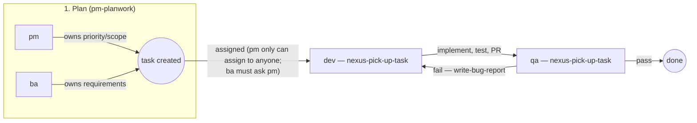

# Workflow — the whole pipeline, one place

Each role's own `.agents/agents/*.md` documents its own step in detail — this file is the missing piece: the *sequence* across all of them, so it's clear who hands to whom and why, instead of that being scattered across four files with no single picture. Read this first for the shape of the process; read the role's own file for the exact mechanics of its step.

Status **names** are never fixed here on purpose — every role's skill says "check `list_statuses` first," because they vary per project. What's fixed is the *sequence of roles* and the *rule that makes hand-off actually work* (below), not any particular status string.

## The main sequence

1. **pm / ba plan** — `nexus-plan-work`. Either can create the task (ADMIN/PM/BA are the only roles that can — `task:create`/`backlog:manage` are `false` for dev/qa, this is a real server-side 403, not convention). Only **pm** can assign it to anyone freely (`task:assign: true`); **ba cannot assign at all** (`task:assign: false`) — ba creates it unassigned and asks pm to assign, or leaves it for pm to pick up during planning.
2. **dev implements** — `nexus-pick-up-task`. Reads full context, checks `blockedBy`, matches repo conventions, implements, verifies (tests/lint/build — optionally with a `qa`-persona pre-check first, see dev's own file), opens a PR, hands off: status change + reassign to qa, together (see "why hand-off is one action" below).
3. **qa tests** — `nexus-pick-up-task`. Checks against acceptance criteria.
   - **Pass** → status to whatever this project calls done/ready, confirm what was checked.
   - **Fail** → `write-bug-report`, status back to whatever means "needs rework," reassign back to whoever implemented it. Never just a comment with no reassignment — an unowned task doesn't show up in anyone's list, it just goes quiet.

That's the whole main line. Everything below is a *side channel* on top of it — none of it replaces this sequence.

## Side channels — questions and pre-checks that don't derail the main sequence

- **A role hits a decision that's genuinely someone else's call mid-step** (not who does the task next — just "what should the answer be") → `nexus-consult-teammate` (same-session, `Agent` tool, fastest, works unattended too) or `nexus-consult-role` (cross-process, real person's real authority, durable `[CONSULT]`/`[ESCALATED]`-tagged record). Neither of these changes who owns the task — the asker keeps working, informed.
- **dev wants a second look before opening the PR** → same mechanism, `subagent_type: "qa"`, tagged `[PRE-CHECK]` — never a substitute for step 3's real QA pass.

## Why hand-off is one action, not two

Every arrow in the diagram above is a **status change and a reassignment happening in the same `update_task` call**, not two separate steps. This isn't style — a status-only or assignee-only update fires no event at all (confirmed by reading the actual route), and it's the event that wakes up the next person/agent's Agent App automatically. Split the two calls and the hand-off still "works" (the data's correct) but nobody gets notified until they happen to check.

## Who can create/assign what — the real, server-enforced matrix

| Action | ADMIN | PM | BA | DEV | QA |
|---|---|---|---|---|---|
| Create task | ✓ | ✓ | ✓ | ✗ | ✗ |
| Create/edit epic, story (`backlog:manage`) | ✓ | ✓ | ✓ | ✗ | ✗ |
| Assign task to anyone (`task:assign`) | ✓ | ✓ | ✗ | owner-only | owner-only |
| Edit task fields (`task:edit`) | ✓ | ✓ | ✓ | owner-only | owner-only |
| Comment (`task:comment`) | ✓ | ✓ | ✓ | ✓ | ✓ |

"owner-only" means: only on a task that role is *currently* the assignee of — a dev can hand off a task they hold, not reassign someone else's. This table is enforced server-side (`src/lib/permissions.ts` in pm-system) — a role's own `.agents/agents/*.md` documents the parts of it that role hits in practice; this table is the one place all of it is visible together.

## Not covered here

Git/branch/PR mechanics (one branch per feature, PR review, never merge your own) — see [`team-setup/TEAM-WORKFLOW.md`](../team-setup/TEAM-WORKFLOW.md). Installing these roles into a repo — see [`roles/README.md`](README.md).
